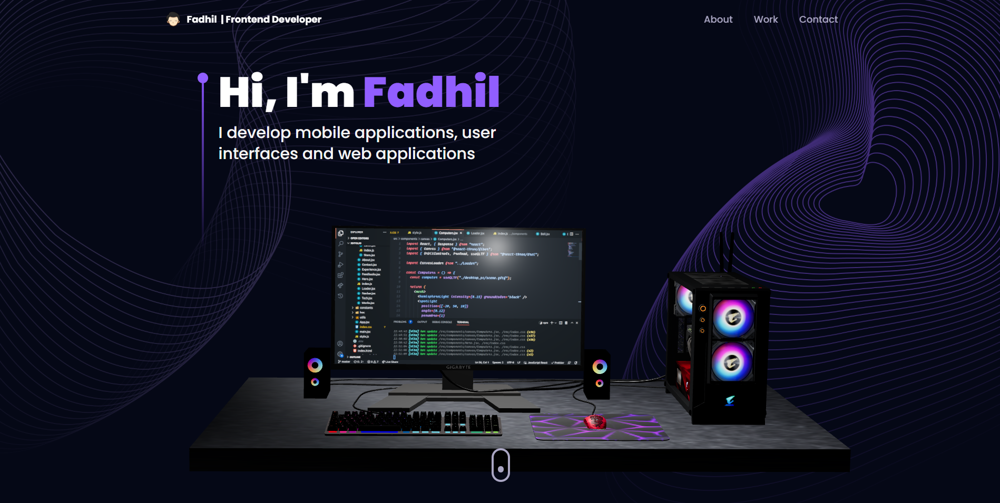

<h1 align="center">3D Portfolio</h1>

<p align="center">This project is a website that displays a 3D Portfolio using React JS</p>

---

<br>

### Detail

<h1 align="center">
  
  
</h1>

## 📱 Features

- Create a layout using Tailwindcss
- Responsive website
- Built with React.js & Three.js

## 🚀 Technologies & Resources

- [x] [React + Vite + TypeScript](https://vitejs.dev/)
- [x] [Tailwindcss](https://tailwindcss.com/docs/installation)
- [x] [Three.js](https://threejs.org/docs/index.html#manual/en/introduction/Installation)
- [x] [React Vertical Timeline](https://stephane-monnot.github.io/react-vertical-timeline/#/)
- [x] [GraphQL](https://graphql.org/learn/)
- [x] [Framer Motion](https://www.framer.com/motion/introduction/)
- [x] [Email.js](https://www.emailjs.com/docs/sdk/installation/)
- [x] [React Three Fiber](https://docs.pmnd.rs/react-three-fiber/getting-started/installation)
- [x] [Hygraph CMS](https://hygraph.com/)

## 💻 Installation

1. #### Clone the repository:

   ```bash
   git clone https://github.com/fadhildwia/portfolio-3D-tailwind-threejs-graphql.git
   ```

2. #### Navigate to the project directory:

   ```bash
   cd portfolio-3D-tailwind-threejs-graphql
   ```

3. #### Install the dependencies:
   ```bash
   yarn
   #or
   npm install
   ```
4. #### Make a copy of `.env.example` to `.env`:
   ```bash
   # Put your VITE_PUBLIC_GRAPHCMS_ENDPOINT credential in .env file
   cp .env.example .env
   ```
5. #### Run the project:
   ```bash
   yarn dev
   #or
   npm run dev
   ```

<!-- ## License

This example application is licensed under the [MIT License](LICENSE).

--- -->

---

Feel free to explore the code and adapt it to suit your needs! If you encounter any issues or have suggestions for improvements, please don't hesitate to open an issue or submit a pull request.
